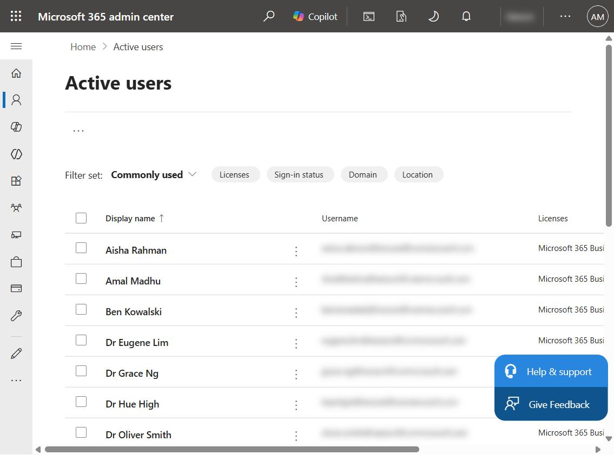
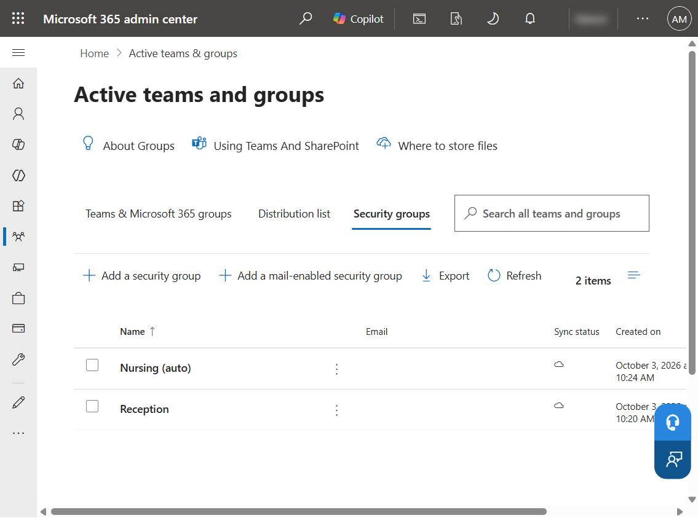
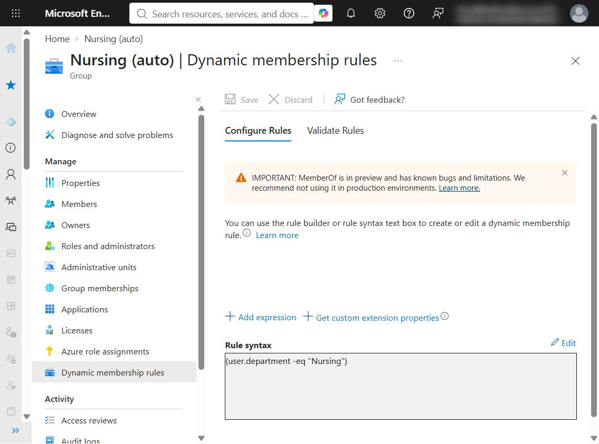
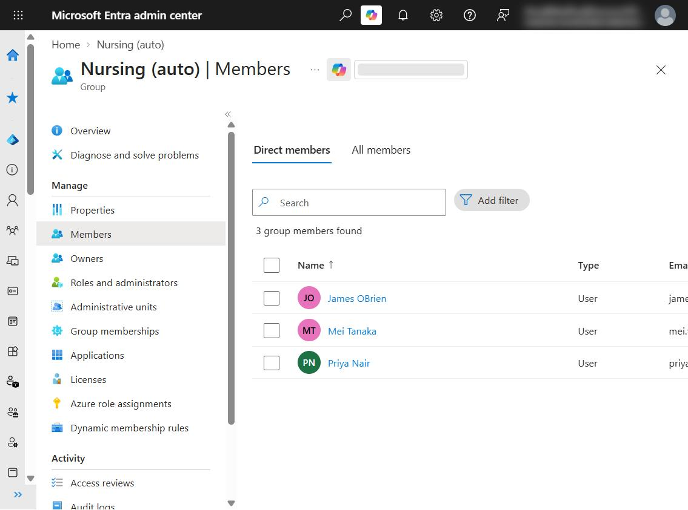

# Lab 01 · Microsoft 365 identity foundations for a medical clinic

**Platform:** Microsoft 365 Business Premium · Microsoft Entra ID P1
**Scenario:** a fictional 15-person medical clinic
**Skills:** user lifecycle, licensing, bulk provisioning, security groups, Microsoft 365 groups, dynamic groups

> Built in my own practice tenant. All staff are fictional; no real patient or employee data was used. Tenant and domain names are blurred in the screenshots.

## What I built

I built a practice Microsoft 365 environment for a fictional medical clinic: staff accounts with licences, job titles and departments, and groups that control who gets access to what. It mirrors how a real small practice is set up on day one.

| Area | What's in place |
| --- | --- |
| Staff accounts | 15 users across Clinical, Nursing, Reception and Management, each with a job title, a department and Australian usage location |
| Licensing | Microsoft 365 Business Premium assigned to every user |
| Onboarding | 5 users created by hand, 10 bulk-imported from a CSV in one step |
| Access groups | **Reception** (security group, assigned), **Nursing (auto)** (security group, dynamic), **Clinical Staff** (Microsoft 365 group, private, with a non-IT owner) |
| Password policy | Passwords auto-generated and forced to change at first sign-in, so the admin never knows a user's password |
| Least privilege | No staff account holds an admin role |

## Design decisions

**Access is given to groups, not individuals.** A new starter gets everything their team needs in one step, and a leaver loses it all in one step. It also prevents access creep, where people keep access from jobs they no longer do.

**Dynamic groups remove manual mistakes, but depend on accurate user data.** *Nursing (auto)* uses the rule `user.department -eq "Nursing"`, so new nurses join automatically and leavers drop out. The trade-off: one typo in a department field ("Nurse" instead of "Nursing") silently gives or removes access, with no error. Clean HR data and periodic membership spot-checks are the control.

**Groups get a business owner.** *Clinical Staff* is owned by the practice manager, not IT, so access requests are approved by someone who knows the team, and IT isn't a bottleneck.

**Bulk provisioning for groups of starters.** Ten staff were imported from a CSV with titles and departments already set, which is faster and less error-prone than typing each one.

## Issue found and fixed

**A user was created without a licence.** In production that means a doctor with an account but no email, Teams or Office on their first day. I assigned the licence and noted two preventions:

1. Filter **Active users → Unlicensed** after every onboarding.
2. Use **group-based licensing** in Entra ID, so membership of a staff group grants the licence automatically. *(Planned for a later lab.)*

## Next

Lab 02 locks the front door: multi-factor authentication, Conditional Access, an emergency break-glass account and least-privilege admin roles.
